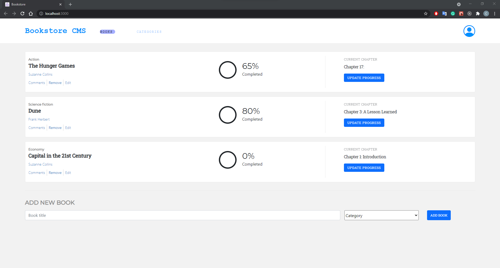

# BookStore

> BookStore made with React/Redux and BookStore API.

## Built With

- JSX
- React
- Redux

# Getting Started with Create React App

This project was bootstrapped with [Create React App](https://github.com/facebook/create-react-app).

## Available Scripts

In the project directory, you can run:

### `npm start`

Runs the app in the development mode.\
Open [http://localhost:3000](http://localhost:3000) to view it in the browser.

The page will reload if you make edits.\
You will also see any lint errors in the console.

### `npm run build`

Builds the app for production to the `build` folder.\
It correctly bundles React in production mode and optimizes the build for the best performance.

The build is minified and the filenames include the hashes.\
Your app is ready to be deployed!

## Authors

👤  **Carlos Ospina**

- GitHub: [Carloso0114](https://github.com/carloso0114)
- LinkedIn: [Carlos Ospina](https://www.linkedin.com/in/carlosospina/)

## 🤝 Contributing

Contributions, issues, and feature requests are welcome!

Feel free to check the [issues page](https://github.com/carloso0114/bookstore-react-redux/issues).

## Show your support

Give a ⭐️ if you like this project!

## Acknowledgments

- React Getting started website

## 📝 License

This project is [MIT](./MIT.md) licensed.